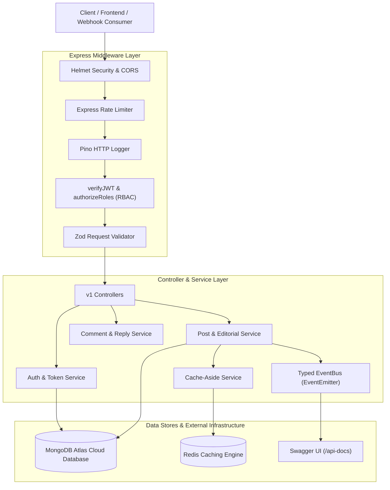

# Quill — Modular Content Publishing Engine

[](https://github.com/Chi-G/Quill/actions/workflows/ci.yml)


A production-ready, modular, TypeScript-first Headless CMS & Content Publishing Platform API. Built on Node.js, Express 5, and MongoDB Atlas (Mongoose), featuring JWT dual-token rotation, 4-tier Role-Based Access Control (RBAC), state-machine editorial workflows, Zod runtime validation, Redis cache-aside invalidation, and OpenAPI 3.0 documentation.

---

## System Architecture



---

## Key Features

* **Dual-Token Authentication & Revocation**: Short-lived Access Tokens returned in JSON and long-lived Refresh Tokens stored in `HttpOnly, Secure` cookies. Refresh tokens are tracked in MongoDB, enabling single-device logout (`/auth/logout`) and multi-device logout (`/auth/logout-all`).
* **4-Tier Role-Based Access Control (RBAC)**: Role hierarchy (`USER` → `AUTHOR` → `EDITOR` → `ADMIN`) enforcing granular access gates.
* **Editorial Workflow State Machine**: Article lifecycle transitions (`DRAFT` → `PENDING_REVIEW` → `PUBLISHED` / `REJECTED` with reason → `ARCHIVED`).
* **Redis Cache-Aside Strategy**: Automated Redis caching on `GET /posts` and `GET /posts/:slug` with targeted cache key invalidation on article publish/update/delete.
* **Nested Comments & Reactions**: Self-referencing nested replies (`parentComment`) with soft deletion, and toggled `LIKE`/`DISLIKE` votes protected by a compound unique index `{ user, post }`.
* **Zod Validation & Pino Logging**: Type-safe payload validation across all endpoints and structured JSON request logging.
* **Interactive Swagger UI**: Live OpenAPI 3.0 documentation hosted at `/api-docs`.

---

## Quickstart

### Option 1: Running with Docker Compose (Recommended)

1. Clone the repository:
   ```bash
   git clone https://github.com/Chi-G/Quill.git
   cd Quill
   ```
2. Start the application stack (App + Redis + MongoDB Atlas):
   ```bash
   docker compose up --build
   ```
3. Access the application:
   * **API Base URL**: `http://localhost:8000/api/v1`
   * **Swagger Interactive Docs**: `http://localhost:8000/api-docs`
   * **Health Check**: `http://localhost:8000/health`

### Option 2: Local Manual Setup

1. Install dependencies:
   ```bash
   npm install --legacy-peer-deps
   ```
2. Copy environment file:
   ```bash
   cp .env.example .env
   ```
3. Run development server with hot-reloading:
   ```bash
   npm run dev
   ```
4. Run integration test suite (in-memory MongoDB):
   ```bash
   npm test
   ```
5. Build production bundle:
   ```bash
   npm run build
   npm start
   ```

---

## API Endpoint Reference (v1)

| Module | Method | Endpoint | Access Level | Description |
|---|---|---|---|---|
| **Auth** | `POST` | `/api/v1/auth/register` | Public | Register new user account |
| **Auth** | `POST` | `/api/v1/auth/login` | Public | Authenticate user, issue access token & refresh cookie |
| **Auth** | `POST` | `/api/v1/auth/refresh-token` | Public | Rotate refresh token and issue new access token |
| **Auth** | `POST` | `/api/v1/auth/logout` | Public | Invalidate refresh token & clear cookie |
| **Auth** | `POST` | `/api/v1/auth/logout-all` | Authenticated | Revoke all active refresh tokens for user across devices |
| **Users** | `GET` | `/api/v1/users/me` | Authenticated | Get current logged-in user profile |
| **Users** | `PATCH` | `/api/v1/users/me` | Authenticated | Update user profile details |
| **Users** | `PATCH` | `/api/v1/users/:id/role` | ADMIN | Update user role (`USER`, `AUTHOR`, `EDITOR`, `ADMIN`) |
| **Posts** | `POST` | `/api/v1/posts` | AUTHOR+ | Create new article draft |
| **Posts** | `GET` | `/api/v1/posts` | Public | Get paginated, searchable, sorted article list |
| **Posts** | `GET` | `/api/v1/posts/:slug` | Public | Get single article by slug |
| **Posts** | `PATCH` | `/api/v1/posts/:id/submit-review` | AUTHOR+ | Submit draft article for editorial review |
| **Posts** | `PATCH` | `/api/v1/posts/:id/approve` | EDITOR+ | Approve and publish pending article |
| **Posts** | `PATCH` | `/api/v1/posts/:id/reject` | EDITOR+ | Reject pending article with explanation |
| **Posts** | `PATCH` | `/api/v1/posts/:id` | Owner/EDITOR+ | Update article content |
| **Posts** | `DELETE` | `/api/v1/posts/:id` | Owner/EDITOR+ | Delete/archive article |
| **Comments** | `POST` | `/api/v1/posts/:id/comments` | Authenticated | Add comment or nested reply |
| **Comments** | `GET` | `/api/v1/posts/:id/comments` | Public | Get comment tree for article |
| **Reactions**| `POST` | `/api/v1/posts/:id/reactions` | Authenticated | Toggle LIKE / DISLIKE vote |
| **Webhooks** | `POST` | `/api/v1/webhooks` | ADMIN | Create outbound webhook subscription |

---

## Roadmap: Herald Webhook Engine Integration

Quill emits a typed internal event stream (`post.published`, `post.updated`, `post.archived`, `comment.created`, `user.registered`) designed to plug into **Herald** (a multi-tenant webhook delivery API) for reliable, retried, observable webhook dispatch to third-party consumers.

---

## License
Distributed under the MIT License. See `LICENSE` for details.
